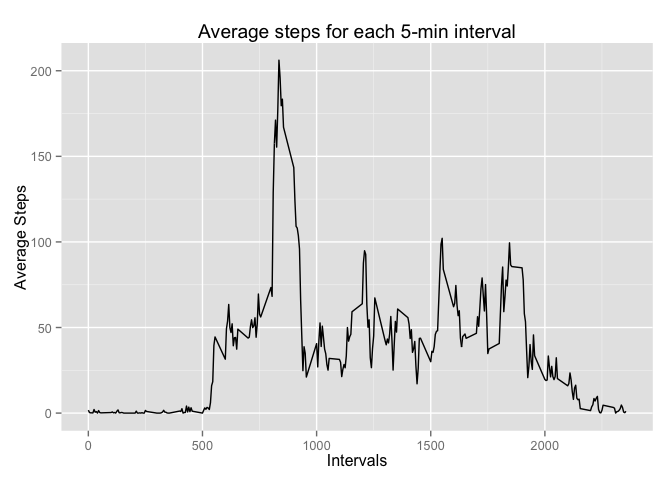

# Reproducible Research: Peer Assessment 1


```r
# Basic settings and load required libraries
echo = TRUE
options(scipen = 1)
library(ggplot2)
library(plyr)
```


## Loading and preprocessing the data

This routine assumes the "repdata-data-activity.zip" file is in the working directory.

Read in the data set

```r
unzip("repdata-data-activity.zip")
fileName = list.files("./",pattern=".csv")[[1]]
data <- read.csv(fileName, colClasses = c("integer", "Date", "factor"))
data_na <- na.omit(data)
rownames(data_na)<-seq_along(data_na[[1]])
data_na$month <- as.factor(format(data_na$date, "%m"))
head(data_na)
```

```
##   steps       date interval month
## 1     0 2012-10-02        0    10
## 2     0 2012-10-02        5    10
## 3     0 2012-10-02       10    10
## 4     0 2012-10-02       15    10
## 5     0 2012-10-02       20    10
## 6     0 2012-10-02       25    10
```

## What is mean total number of steps taken per day?


```r
ggplot(data_na, aes(date, steps)) + 
        geom_bar(stat = "identity") + 
        facet_grid(. ~ month, scales = "free") + 
        labs(title = "Total number of steps taken each day", 
             x = "Date", 
             y = "Total number of steps")
```

 

The mean total number of steps taken per day is calculated as follows:


```r
totalNumberSteps<-with(data_na,aggregate(steps, list(Date = date), FUN = "sum")$x)
mean(totalNumberSteps)
```

```
## [1] 10766.19
```

The median total number of steps taken per day:

```r
median(totalNumberSteps)
```

```
## [1] 10765
```

The results indicates that the mean and median are quite close.


## What is the average daily activity pattern?

Create a dataset: interval_result, which is the average steps per time interval. Measurements are recorded at 5 mint intervals throughout the day.


```r
averStepPerInterval <-aggregate(data_na$steps, 
                    by=list(interval=as.numeric(as.character(data_na$interval))), 
                    FUN=mean)
colnames(averStepPerInterval)<-c("timeInterval","averageSteps")
ggplot(averStepPerInterval, aes(timeInterval, averageSteps)) + 
        geom_line() + 
        ggtitle("Average steps for each 5-min interval")+ 
             xlab( "Intervals")+ 
             ylab("Average Steps")
```

 

Which 5-minute interval contains the **maximum number of steps**?


```r
averStepPerInterval[averStepPerInterval$averageSteps == max(averStepPerInterval$averageSteps), ]
```

```
##     timeInterval averageSteps
## 104          835     206.1698
```

## Imputing missing values

The number of incomplete records is: 2304.

To fill in the data, we will use the average for the relevant 5-min interval to fill each NA value 

```r
dataNAfilled <- data
for (n in 1:nrow(data)){
        if (is.na(data$steps[n])){
                dataNAfilled$steps[n]=mean(data[data$interval==data$interval[n],"steps"],na.rm=TRUE)
        }
}
sum(is.na(dataNAfilled)) # check if 'NA' exists in the 'dataNAfilled'
```

```
## [1] 0
```

In order to know whether the imputed values have impacts on the total number of steps taken per day, we re-caluate the mean and median total number of steps taken per day.

The new mean total number of steps taken per day is calculated as follows:


```r
newTotalNumberSteps<-with(dataNAfilled,aggregate(steps, list(Date = date), FUN = "sum")$x)
mean(newTotalNumberSteps)
```

```
## [1] 10766.19
```

The new median total number of steps taken per day:

```r
median(newTotalNumberSteps)
```

```
## [1] 10766.19
```
Comparing the new and old mean and median values:

```r
mean(newTotalNumberSteps)-mean(totalNumberSteps)
```

```
## [1] 0
```

```r
median(newTotalNumberSteps)-median(totalNumberSteps)
```

```
## [1] 1.188679
```

Thre comparison results indciates shows that, whereas new mean is the same as the old mean, the new meidan is higher than the old median.


## Are there differences in activity patterns between weekdays and weekends?

First, we need to create a new factor variable (named as "weekday") with two levels: weekday or weekend.


```r
listWeekday = c("Monday", "Tuesday", "Wednesday", "Thursday", "Friday")
dataNAfilled$weekday<-as.factor(ifelse(weekdays(dataNAfilled$date) %in% listWeekday,'weekday', 'weekend'))
                                
averStepPerInterval<-with(dataNAfilled,aggregate(steps, 
                            by=list(interval = as.numeric(as.character(interval)),weekday = weekday),
                            FUN=mean))
     
colnames(averStepPerInterval)<-c("timeInterval","weekday","averageSteps")
```

Then, we plot the weekday and weekend results side by side:
 
 

```r
ggplot(averStepPerInterval,aes(x=timeInterval,y=averageSteps))+
  facet_wrap(~weekday,ncol=1,nrow=2)+
  geom_line()+
  theme_bw()+
  ggtitle("Average steps for each 5-min interval")+ 
        xlab("Intervals")+ 
        ylab("Average Steps")
```

 

